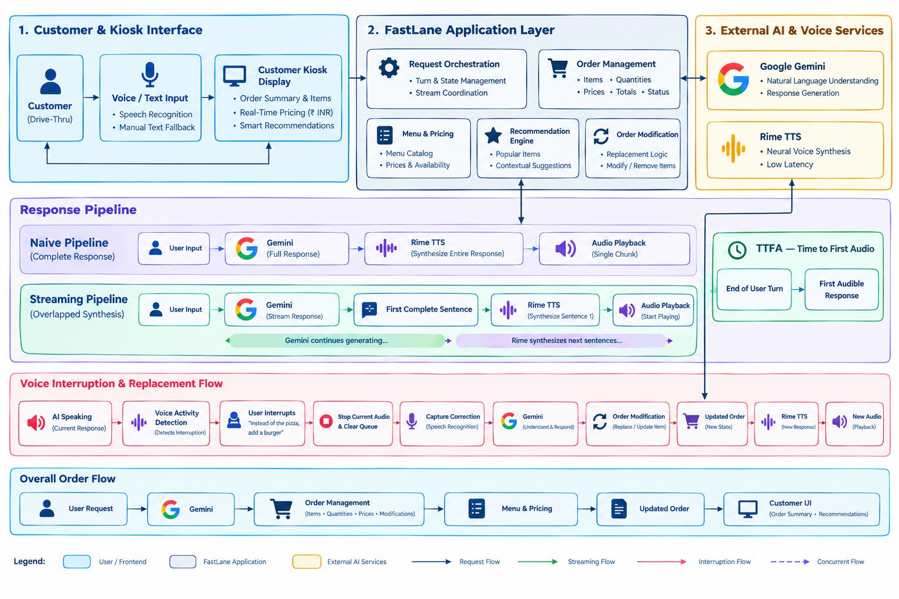

# FastLane

### Live Demo

**[Try FastLane](https://fastlane-three-delta.vercel.app)**

## 1. Project Overview
FastLane is an ultra-low-latency voice ordering assistant designed for quick-service restaurant (QSR) and drive-thru environments. Powered by **Rime TTS** and **Google Gemini**, FastLane demonstrates how pipelining sentence-level speech synthesis concurrently with LLM token generation reduces conversational response latency by overlapping sentence-level speech synthesis with ongoing LLM generation (Time to First Audio).


---

## 2. User & Problem
In drive-thru voice systems, conversational responsiveness directly dictates customer throughput and order confidence. The critical latency bottleneck in conversational voice agents is:

$$\text{Time to First Audio (TTFA)} = \text{End of User Turn} \to \text{First Audible Spoken Word}$$

In traditional (Naive) voice pipelines:
1. The customer finishes speaking.
2. Speech-to-Text (STT) transcribes the speech.
3. The LLM generates the entire multi-sentence confirmation response.
4. The system sends the complete text block to a Text-to-Speech (TTS) engine.
5. The audio synthesizes and finally begins playing in the user's speaker.

Waiting for the full LLM response before triggering speech synthesis can add several seconds of delay. In FastLane's 30-run benchmark, the Naive pipeline measured 3.14s on the cold run and 2.67s average across warm runs for its first synthesized audio.

---

## 3. Why Voice is Essential

In a physical drive-thru lane, voice is the primary interface. Drivers must keep their hands on the wheel and eyes on the lane, making visual screens secondary. If a voice system takes multiple seconds to respond, drivers assume the system didn't hear them and repeat themselves, causing collision errors, broken order states, and delayed queue times. Reducing response latency toward natural conversational pauses is important for maintaining a responsive drive-thru interaction.

## 4. Architecture
FastLane processes customer orders through an end-to-end voice pipeline:

```
[Customer Speaks / Enters Text]
              │
              ▼
[Speech-to-Text (STT)]
  • Browser Web Speech API (webkitSpeechRecognition / SpeechRecognition)
  • Manual text input fallback
              │
              ▼ (POST /api/pipeline via Server-Sent Events)
[FastLane Orchestration Engine (server.js & services/pipelineService.js)]
              │
      ┌───────┴────────────────────────────────────────┐
      ▼                                                ▼
[Streamed Pipeline (Fast Mode)]              [Naive Pipeline (Standard Mode)]
      │                                                │
Gemini token stream begins                   Gemini generates 100% full reply
(streamGenerateContent?alt=sse)              (generateContent)
      │                                                │
SentenceParser detects 1st sentence          Full text generation completes
boundary ('.', '!', '?')                               │
      │                                      Dispatch entire text to Rime TTS API
Dispatch 1st sentence to Rime TTS API                  │
(POST https://users.rime.ai/v1/rime-tts)      Full audio buffer received
      │                                                │
1st sentence audio received (MP3)            Browser begins audible playback
      │
Browser begins AUDIBLE playback (t₁)
      │
Subsequent sentences synthesized & queued
concurrently while user listens
```

---

## 5. Setup Instructions

### Prerequisites
- Node.js 20+ (ES Modules support required)
- A valid Rime API key ([app.rime.ai](https://app.rime.ai))
- A valid Google Gemini API key ([aistudio.google.com](https://aistudio.google.com))

### Installation
```bash
git clone https://github.com/Hiten0305l/FLane.git
cd FLane
npm install
```

### Running the Application
FastLane provides the following npm scripts defined in `package.json`:
- **Check Voice Catalog**:
  ```bash
  npm run catalog:check
  ```
- **Start Development Server**:
  ```bash
  npm run dev
  ```
- **Start Production Server**:
  ```bash
  npm start
  ```
- **Run Acceptance Benchmark**:
  ```bash
  npm run benchmark
  ```
Once the server is running, open [http://localhost:3000](http://localhost:3000) in your browser.

---

## 6. Environment Variables
Create a `.env` file from `.env.example`:
```bash
cp .env.example .env
```
Populate `.env` with your API credentials:
```env
# FastLane Environment Configuration
RIME_API_KEY=your_rime_api_key_here
GEMINI_API_KEY=your_gemini_api_key_here
PORT=3000
For Vercel deployment, configure `RIME_API_KEY` and `GEMINI_API_KEY` as server-side environment variables.
```
*(Note: `.env` is listed in `.gitignore` and must never be committed to source control).*

---

## 7. Third-Party Services
FastLane connects to the following external APIs:
1. **Rime TTS API**:
   - **Synthesis Endpoint**: `https://users.rime.ai/v1/rime-tts` (HTTP POST) — audio synthesis.
   - **Voice Catalog Endpoint**: `https://users.rime.ai/data/voices/all-v2.json` (HTTP GET) — queries available models and verified English speaker IDs.
2. **Google Gemini API**:
   - **Streamed Generation Endpoint**: `https://generativelanguage.googleapis.com/v1beta/models/gemini-flash-lite-latest:streamGenerateContent?key=${apiKey}&alt=sse` (HTTP POST, SSE) — used in Streamed mode.
   - **Full Generation Endpoint**: `https://generativelanguage.googleapis.com/v1beta/models/gemini-flash-lite-latest:generateContent?key=${apiKey}` (HTTP POST, JSON) — used in Naive mode.
3. **Speech-to-Text (STT)**:
   - **Browser Web Speech API**: `window.SpeechRecognition` / `window.webkitSpeechRecognition` executing client-side in the browser (`public/app.js`). Direct manual text entry is provided as a non-microphone fallback.

---

## 8. Gemini Integration
- **Model**: `gemini-flash-lite-latest` via Google Generative Language API.
- **System Instructions**: Configured in `services/geminiService.js` for natural conversational English order confirmations (1 to 2 short sentences, concise, conversational tone, Indian Rupee pricing, and structured order state extraction via `ORDER_STATE: {"items": [...], "confirmed": boolean}`).
- **Dynamic Phrasing**: Generates concise conversational responses and incorporates the current order state, including changes made after interruptions.

---

## 9. Rime Integration
Rime is the primary voice synthesis engine across all spoken flows in FastLane:
- **Model ID**: `coda`
- **Speaker / Voice Name**: `astra` (natural English conversational voice)
- **Language Code**: `eng` in catalog resolution, submitted as `'en'` in API payload (`lang: activeLang || 'en'`)
- **Endpoint**: `https://users.rime.ai/v1/rime-tts`
- **Audio Format & Sample Rate**: `audio/mpeg` (requested via header `'Accept': 'audio/mpeg'`), `samplingRate: 24000` (24 kHz)
- **Transport**: HTTP POST with `Authorization: Bearer ${apiKey}` and JSON payload, returning binary MP3 array buffer.

---

## 10. Naive vs. Streamed Modes
1. **Naive Pipeline (Standard Mode)**:
   - Blocks on full Gemini text completion before dispatching text to Rime TTS.
   - Full audio is returned and played in one contiguous piece.
   - In the benchmark, the first synthesized audio was received after approximately 2.67s on warm runs and 3.14s on the cold run.
2. **Streamed Pipeline (Fast Mode)**:
   - Dispatches the first grammatical sentence (`.`, `!`, `?`) to Rime immediately as tokens stream from Gemini.
   - The first complete sentence is dispatched to Rime as soon as it is available, allowing synthesis to overlap with continued Gemini generation.
   - Subsequent sentences synthesize concurrently in the background and are queued seamlessly.

---
## 11. TTFA Definition and Measurement

**Time to First Audio (TTFA)** measures the time from the end of the user's turn until the first audible response begins.

In the live browser UI:

$$
\text{TTFA} = t_{\text{first audible playback}} - t_{\text{user release}}
$$

- **t₀ — User Release:** The instant the user submits the order turn.
- **t₁ — First Audible Playback:** When the browser begins playing the first response audio.
- **TTFA:** The elapsed time between these two points.

The application UI records browser playback timing separately from the server-side pipeline timing.

The automated `npm run benchmark` reports **time to first synthesized audio received from the Rime pipeline**, which is used for the reproducible Naive vs. Streamed comparison.

---

## 12. Failure & Fallback Behavior
1. **Timeout & Catch**:
   - In `services/pipelineService.js`, each sentence synthesis call to Rime is wrapped with a 10-second timeout (`timeoutMs: 10000`).
   - If a Rime API request fails, times out, or network connectivity drops, the error is caught within the sequential synthesis promise chain (`synthChain.catch`), recording `streamFailureError`.
2. **Automatic Fallback to Naive Mode**:
   - `executeStreamedPipeline` immediately logs the failure and emits a `fallback` event over Server-Sent Events.
   - The server then automatically calls `executeNaivePipeline` with `fallbackTriggered: true`, ensuring order completion.
3. **Client UI State Update**:
   - In `public/app.js`, upon receiving the `fallback` event, the client triggers `setMode('naive')`.
   - The UI updates the active badge to **🐢 Naive Mode**, switches the telemetry stage descriptions to sequential full-reply mode, and informs the user.

---

## 13. Known Limitations

###  Cold start vs. warm run latency
Inspecting the current benchmark implementation and the actual `benchmark_results.json` reveals a notable difference between initial cold requests and subsequent warm requests:
- **Streamed Pipeline**: Cold start latency measured **2,306 ms**, compared to a warm run average of **1,858 ms**.
- **Naive Pipeline**: Cold start latency measured **3,142 ms**, compared to a warm run average of **2,666 ms**.
- **Latency Reduction**: - Streamed mode measured a 27% lower cold-run first-audio latency and a 30% lower warm-run average in the recorded 30-run benchmark.

After starting or restarting the server, the very first request incurs connection-level overhead, including DNS lookups, TLS handshakes to both `generativelanguage.googleapis.com` and `users.rime.ai`, and initial voice catalog resolution. Subsequent warm requests benefit from persistent HTTP keep-alive sockets and memory-cached voice metadata, resulting in lower, steady-state response times.


---
## 14. Reproduction & Benchmark Instructions

To reproduce the acceptance benchmark:

```bash
npm run benchmark
```

### What the benchmark measures

The benchmark runs 15 Naive and 15 Streamed trials against the live Gemini and Rime services.

The reported latency is **the time from the benchmark start timestamp to receipt of the first synthesized Rime audio**. It is **not a physical speaker measurement**.

The first run of each pipeline is labeled **Cold**; subsequent runs are labeled **Warm**.

Results are reported in `benchmark_results.json`.

---

## 15. Exact Rime Configuration

The shipped application strictly uses:

- **Model ID:** `coda`
- **Speaker:** `astra`
- **Language:** `eng` / `en`
- **Endpoint:** `https://users.rime.ai/v1/rime-tts`
- **Audio Format:** `audio/mpeg` (24 kHz)
- **Transport:** HTTP POST with JSON body and Bearer token
